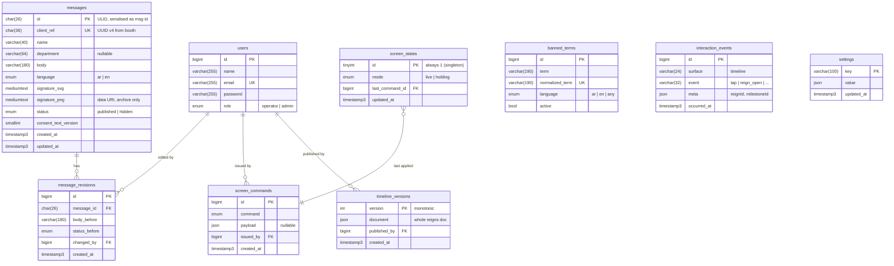

# ND96 — Database Design

Target: **MySQL 8 / MariaDB, utf8mb4**, Laravel migrations. Derived from the API
contract ([FRONTEND-SPEC.md](FRONTEND-SPEC.md) §4–§5) and the accepted proposal's
terms (PR-0011). The database serialises to those API shapes exactly — if a
column here and a field there disagree, the API contract wins.

## Principles

1. **The server is the source of truth.** Every rule the frontend renders
   (word filter, limits, publishability) lives in a table or in code here.
2. **Idempotent writes.** `client_ref` is UNIQUE — a duplicate booth submit
   returns the existing row, never a second message. This is the non-negotiable
   from spec §4: the booth iPad WILL drop Wi-Fi mid-submit.
3. **Hidden, never deleted.** No hard deletes of messages; moderation flips
   `status` and records a revision. `resetEvent` archives, it does not truncate.
4. **UTC everywhere, millisecond precision.** `TIMESTAMP(3)`. Second-precision
   `since` cursors drop ties when two messages land in the same second.
5. **Config over constants.** Everything the frontend reads from
   `GET /api/config` comes from the `settings` table — changeable on event day
   without a deploy.

## Entity overview



## Tables

### `messages` — the heart of the event

| Column | Type | Notes |
|---|---|---|
| `id` | `CHAR(26)` PK | ULID (`HasUlids`); API serialises as `"msg_" . id` or raw ULID — pick one and freeze it |
| `client_ref` | `CHAR(36)` **UNIQUE** | UUID v4 generated by the booth; the dedupe key |
| `name` | `VARCHAR(40)` | trimmed; 2–40 validated |
| `department` | `VARCHAR(64)` NULL | free value from the config list — no FK, the list is config |
| `body` | `VARCHAR(180)` | utf8mb4; 10–180 validated |
| `language` | `ENUM('ar','en')` | |
| `signature_svg` | `MEDIUMTEXT` | returned in every `GET /api/messages` row — the wall renders it inline |
| `signature_png` | `MEDIUMTEXT` NULL | base64 data URI; **archive only**, never returned to the wall payload |
| `status` | `ENUM('published','hidden')` default `published` | |
| `consent_text_version` | `SMALLINT` | which version of the bilingual consent notice was on screen at submit |
| `created_at` / `updated_at` | `TIMESTAMP(3)` | UTC |

Indexes:

```sql
UNIQUE KEY uq_messages_client_ref (client_ref),
KEY idx_messages_wall (status, created_at, id)   -- the 2s poll hot path
```

**Idempotent insert** (`POST /api/messages`): attempt insert; on duplicate
`client_ref`, select and return the existing row with `201`. Same response
either way — the booth cannot tell a retry from a first submit, by design.

**Hot query** (wall poll, every 2s per screen):

```sql
SELECT ... FROM messages
WHERE status = 'published' AND (created_at, id) > (:since, :since_id)
ORDER BY created_at DESC, id DESC
LIMIT 200;
```

The `(created_at, id)` tuple cursor is why `TIMESTAMP(3)` + the composite index
matter: `since` alone loses messages that share a timestamp. Encode the cursor
as opaque base64 in `nextCursor`.

Sizing: ~900 messages × ~150 KB PNG ≈ 140 MB — fine inline at this scale. If
Abdullah prefers, move `signature_png` to `storage/app/signatures/{id}.png`
with a path column instead; the API contract doesn't change either way.

### `message_revisions` — moderation audit

One row per console edit (body correction or status flip): `message_id`,
`body_before`, `status_before`, `changed_by`, `created_at`. Cheap, and it makes
"an operator tapped the wrong row" fully recoverable — the proposal's
"in-place correction" with accountability.

### `banned_terms` — the word filter

| Column | Type | Notes |
|---|---|---|
| `term` | `VARCHAR(190)` | as entered |
| `normalized_term` | `VARCHAR(190)` UNIQUE | after Arabic normalization |
| `language` | `ENUM('ar','en','any')` default `any` | |
| `active` | `BOOL` default true | soft-disable instead of delete |

Normalization happens in code, applied to **both** the term and the submitted
body before matching: strip tatweel (ـ) and diacritics, unify alef variants
(أ إ آ → ا), ta marbuta (ة → ه optional), lowercase Latin. Rejection returns the
`CONTENT_REJECTED` envelope from spec §4 and stores **nothing** (optionally log
rejected attempts to a separate table if SATORP wants filter-tuning data —
decision for Abdullah, not required by the contract).

### `timeline_versions` — the whole document, versioned

The API treats the timeline as one JSON document replaced wholesale with
optimistic locking, so the table should too:

| Column | Type | Notes |
|---|---|---|
| `version` | `INT UNSIGNED` PK | monotonic |
| `document` | `JSON` | the full `{ reigns: [...] }` doc, exactly the API shape |
| `published_by` | FK `users` NULL | |
| `created_at` | `TIMESTAMP(3)` | |

- `GET /api/timeline` → row with `MAX(version)`.
- `PUT /api/timeline` → in a transaction: if incoming `version` ≠ current →
  **409**; else insert `version + 1`.

Full history for free, rollback is an insert, and there's no impedance
mismatch with the API. A relational `reigns`/`milestones` model buys nothing
for a 21-node document that is only ever read and replaced whole.

### `screen_states` + `screen_commands`

`screen_commands` is the append-only audit log of every console command
(`clear` / `holding` / `resume` / `resetEvent` / `feature`, plus `payload`).

`screen_states` is a singleton row holding the **current desired state**
(`mode: live | holding`, `last_command_id`). Broadcasting a command over
Reverb covers the WebSocket transport — but our default ship is **polling**,
and a wall that reboots mid-holding must come back in holding.

> **Contract addition needed (flag for the Thursday sign-off):** either a
> `GET /api/screen/state` endpoint the wall polls alongside messages, or embed
> `screenState` in the `GET /api/messages` poll response. Without one of
> these, screen commands only work on the Echo transport and criterion 12
> fails on the polling baseline.

### `interaction_events` — the KPI framework

The proposal commits to "analytics built into the system," and `GET /api/stats`
already returns `timelineTaps` — but nothing in the current contract lets the
timeline report them.

| Column | Type | Notes |
|---|---|---|
| `surface` | `VARCHAR(24)` | `timeline` for now |
| `event` | `VARCHAR(32)` | `tap`, `reign_open`, `milestone_open` |
| `meta` | `JSON` NULL | `{ reignId, milestoneId }` — enables per-reign KPIs |
| `occurred_at` | `TIMESTAMP(3)` | client-stamped, server-bounded |

> **Contract addition needed:** `POST /api/interactions` accepting a batched
> array (the timeline flushes every ~10s or 20 events), so a busy screen isn't
> making a request per touch. `GET /api/stats` aggregates from here.

### `settings` — everything `/api/config` serves

Key–value with JSON values: `event.name`, `languages`, `default_language`,
`limits` (`nameMax`, `bodyMax`), `departments` (array), `features`,
`wall.feature_seconds`, `wall.slots`, `consent.text_version`,
`consent.text_ar`, `consent.text_en`. Cache the composed config for ~10s.
On event day, changing `wall.feature_seconds` must be an UPDATE, not a deploy.

### `users` + framework tables

Laravel's standard `users` (+ `role ENUM('operator','admin')`), and the stock
framework tables: `sessions` (database driver — Sanctum same-origin cookie
auth), `cache`, `jobs`/`failed_jobs` (broadcast queue, if Reverb is switched
on). `personal_access_tokens` only if the bearer-token fallback is ever used.

## Endpoint → table map

| Endpoint | Reads | Writes |
|---|---|---|
| `GET /api/config` | `settings` | — |
| `POST /api/messages` | `banned_terms`, `messages` (dedupe) | `messages` |
| `GET /api/messages` | `messages` | — |
| `PATCH /api/messages/:id` | `messages` | `messages`, `message_revisions` |
| `GET /api/timeline` | `timeline_versions` | — |
| `PUT /api/timeline` | `timeline_versions` (version check) | `timeline_versions` |
| `POST /api/screen/commands` | — | `screen_commands`, `screen_states` |
| `GET /api/screen/state` *(proposed)* | `screen_states` | — |
| `POST /api/interactions` *(proposed)* | — | `interaction_events` |
| `GET /api/stats` | `messages`, `interaction_events` | — |

## Data, consent & retention

Per the proposal's Data & Consent term: **name, message, signature only — no
photographs.** All of it is PII. The post-event archive (all messages +
signatures + participation summary) is a handover deliverable to SATORP;
retention/purge after handover is governed by **Schedule D (Cybersecurity
Requirements), still not received** — until it lands, keep everything on the
single event host, no third-party services, no external backups of PII.

## Open decisions for Abdullah

1. `GET /api/screen/state` vs. embedding state in the messages poll — pick one
   by Thu 4 Sep so it's in the signed contract.
2. `signature_png` inline vs. on disk (API-invisible either way).
3. Log rejected (word-filtered) submissions for tuning — yes/no.
4. Public message id format: raw ULID vs `msg_` prefix — freeze it in the
   contract; the frontend treats it as opaque.
